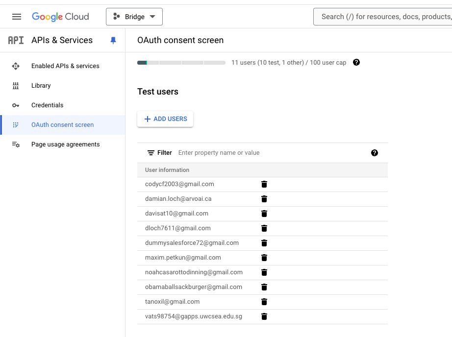
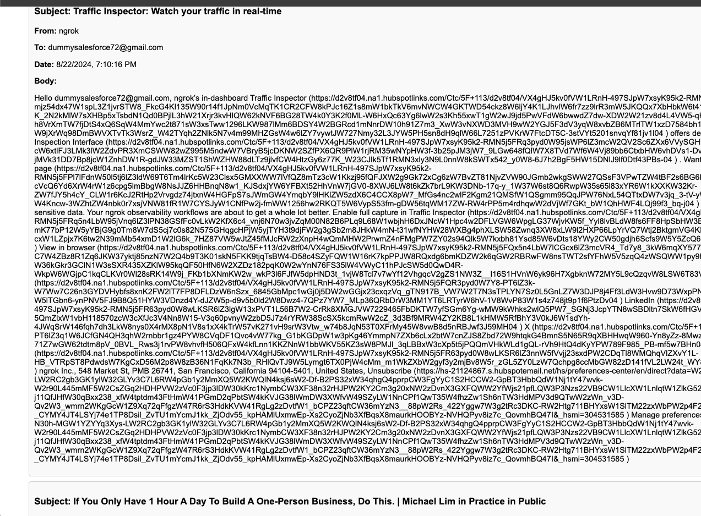

### backend

1. Open `cd backend`.
2. run `node backend/app.mjs`

### frontend

1. run `python -m http.server 8001`
2. Then open `http://localhost:8001` in a web browser.

click big green button to connect. will only work with accounts added onto the google cloud bridge: more specifiaclly these accounts

then emails should appear on the screen

***make sure to change the .env to your nango secret-key,

[text](<Screen Recording 2024-08-23 at 2.20.51 PM.mov>)